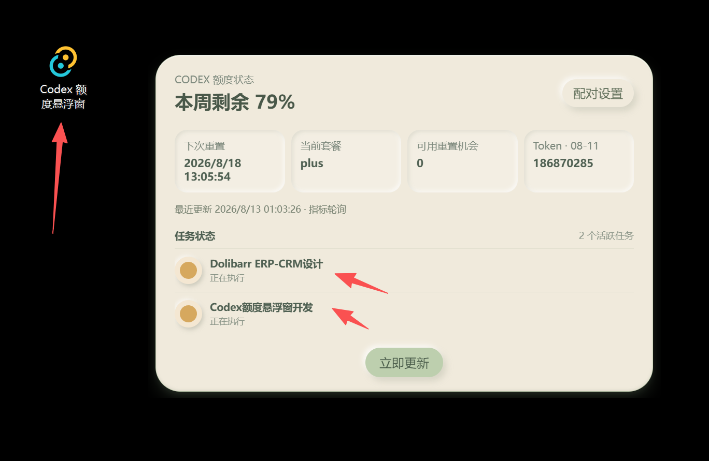
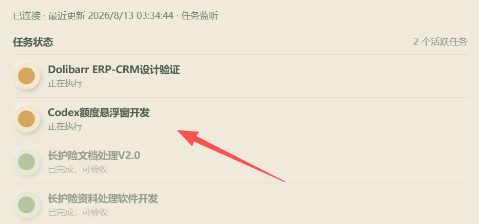
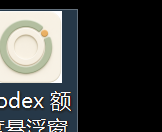

# Codex QuotaOrb

Codex QuotaOrb is a lightweight Windows desktop companion for checking Codex usage at a glance. It keeps a small floating indicator on the desktop and lets you cycle through the weekly quota, task status, and daily token usage.

Codex QuotaOrb 是一款轻量的 Windows 桌面伴侣，用于快速查看 Codex 使用情况。它在桌面保留一个小型悬浮指示器，并可循环查看本周额度、任务状态和本日 Token 用量。



## Highlights / 主要功能

- **Three compact views / 三种紧凑视图** — Double-click to cycle through the floating orb, the three-part capsule, and the details page. / 双击循环切换悬浮球、三等分胶囊和详情页。
- **Weekly quota / 本周额度** — A circular percentage indicator makes remaining quota visible immediately. / 圆环百分比让剩余额度一眼可见。
- **Task status / 任务状态** — Active, waiting, and completed tasks use clear status colors. / 通过颜色区分执行中、等待处理和已完成任务。
- **Daily token usage / 本日 Token** — The compact views show the current daily total. / 紧凑视图显示本日累计 Token。
- **Quiet desktop presence / 安静待在桌面** — Frameless, draggable, rounded UI with a cream, sage, and apricot palette. / 无边框、可拖动、圆角悬浮界面，采用奶油白、鼠尾草绿和杏色配色。
- **Local Codex sync / 本机 Codex 同步** — The app reads the local Codex app-server state and marks stale or failed data clearly. / 读取本机 Codex app-server 状态，数据过期或读取失败时明确提示。
- **Tray controls / 托盘控制** — Refresh, pairing settings, startup behavior, update check, and quit are available from the tray menu. / 托盘菜单提供刷新、配对设置、开机自启、检查更新和退出。



## Screenshots / 界面预览

| Details page / 详情页 | Desktop icon / 桌面图标 |
| --- | --- |
|  |  |

## Installation / 安装

1. Download the latest Windows installer from [GitHub Releases](https://github.com/nf2huochao/Codex-QuotaOrb/releases).
2. Run the `.exe` installer.
3. Start Codex and launch Codex QuotaOrb.
4. Use the tray menu to configure startup and pairing settings.

1. 从 [GitHub Releases](https://github.com/nf2huochao/Codex-QuotaOrb/releases) 下载最新 Windows 安装包。
2. 运行 `.exe` 安装程序。
3. 启动 Codex，再启动 Codex 额度悬浮窗。
4. 通过托盘菜单设置开机自启和配对选项。

## Scope and privacy / 范围与隐私

This project is designed for local Windows use. The current release does **not** include Cloudflare Tunnel, public Internet access, or any hosted relay service. Pairing is intended for devices on the same Wi-Fi network. The project does not bundle Codex account credentials; local state is read from the running Codex app-server.

本项目面向本机 Windows 使用。当前版本**不包含** Cloudflare Tunnel、互联网公开访问或云端中转服务；配对面向同一 Wi-Fi 网络内的设备。项目不打包 Codex 账号凭据，只读取正在运行的 Codex app-server 本地状态。

## Development / 本地开发

Requirements: Node.js, Rust, and the Windows C++ build tools.

环境要求：Node.js、Rust 和 Windows C++ 构建工具。

```powershell
npm.cmd install
npm.cmd test
npm.cmd run tauri dev
```

Build a Windows installer / 构建 Windows 安装包：

```powershell
npm.cmd run tauri build
```

The installer is written to `src-tauri/target/release/bundle/nsis/`. Signed update artifacts are produced by GitHub Actions when the repository signing secrets are configured. Never commit signing keys or passwords.

安装包输出到 `src-tauri/target/release/bundle/nsis/`。配置仓库签名密钥后，GitHub Actions 会生成签名更新文件。请勿把签名私钥或密码提交到仓库。

## Release history / 版本记录

See [CHANGELOG.md](CHANGELOG.md) for the bilingual release notes.

版本新增和改进内容请查看[CHANGELOG.md](CHANGELOG.md)。
