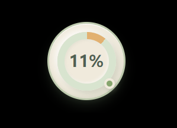
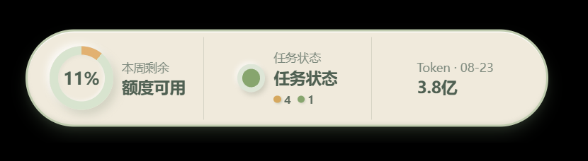
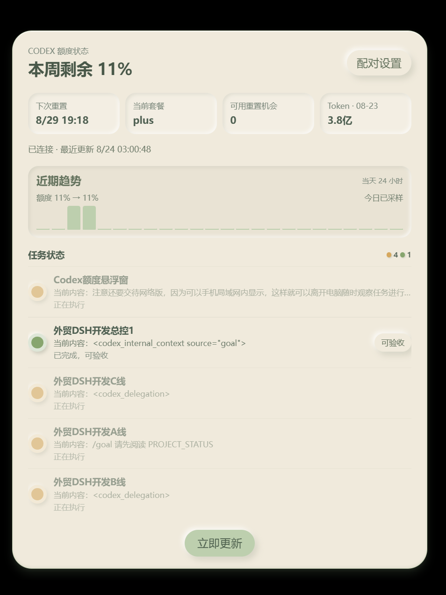
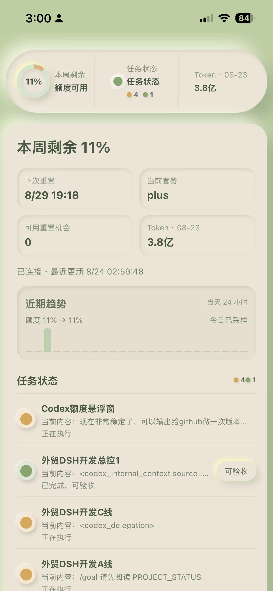

# Codex QuotaOrb

Codex QuotaOrb 是一个面向 Windows 的 Codex 桌面伴侣：用一个安静的悬浮球和胶囊，把本周额度、任务状态和本日 Token 放在桌面第一视线；需要查看细节时，再进入详情页。

Codex QuotaOrb is a Windows companion for Codex. It keeps weekly quota, task state, and daily Token usage visible in a small desktop HUD, while a details view provides the full task list and refresh state.

## 软件定义 / What it is

它不是 Codex 客户端，也不会替代 Codex。它只负责读取本机 Codex 的可用状态并进行展示：Windows 桌面端提供悬浮 HUD；同一 Wi‑Fi 下，手机、平板或 Kindle 浏览器可以打开局域网网页查看同一份快照。

It is not a Codex client and does not replace Codex. It presents locally available Codex state through a Windows HUD and a LAN web view. A phone, tablet, or Kindle browser can observe the same snapshot over the same Wi‑Fi network while the Windows host remains online.

## 界面预览 / Interface preview

### 桌面悬浮球 / Desktop orb

<p align="center"></p>

### 三等分胶囊 / Three-part capsule

<p align="center"></p>

### 详情页 / Details page

<p align="center"></p>

### 手机局域网网页 / Mobile LAN web view

<p align="center"></p>

手机网页端是本项目的重要使用方式：在 Windows 主机显示的配对地址打开网页后，手机可以离开电脑桌面，在同一局域网内随时观察任务进度、额度和 Token。网页端不需要安装 App；Windows 主机必须保持开机、联网并运行悬浮窗。

The LAN web view is a first-class use case. Open the pairing address on a phone while both devices are on the same Wi‑Fi network, then keep observing tasks away from the Windows desktop. No mobile app is required, but the Windows host must remain powered on, connected, and running QuotaOrb.

## 功能特性 / Features

- **三种桌面视图 / Three desktop views** — 双击悬浮球循环切换悬浮球、三等分胶囊和详情页。 Double-click cycles through the orb, capsule, and details page.
- **额度一眼可见 / Quota at a glance** — 圆环显示本周剩余百分比；详情页显示下次重置、套餐和可用重置机会。 The ring shows weekly remaining quota; details include reset time, plan, and reset opportunities.
- **统一任务状态 / Unified task state** — 任务使用黄色（执行中）、红色（需要批准/拒绝）、绿色（完成可验收）和灰色（无活跃任务）。胶囊和详情页来自同一份任务快照。 Yellow means running, red means approval/rejection is needed, green means completed and ready for review, and gray means no active task. The capsule and details page share one task snapshot.
- **任务阻塞提示 / Possible-blocking hint** — 长时间没有新事件时，以紧凑的橙红提示点提醒可能阻塞，不把普通文本关键词当成状态。 A compact orange-red indicator can flag a possible stall without treating arbitrary log text as state.
- **本日 Token / Daily Token** — 紧凑视图和详情页显示当天累计 Token，并使用万、亿等中文单位缩写。 Compact views show the daily total with Chinese unit formatting.
- **趋势记录 / Lightweight history** — 详情页按小时记录当天额度变化，便于判断用量趋势。 The details page records hourly quota changes for the current day.
- **局域网网页 / LAN web view** — 同一 Wi‑Fi 下通过浏览器查看，支持手机、平板和 Kindle 等设备。 Observe from phones, tablets, and Kindle browsers on the same Wi‑Fi.
- **托盘控制 / Tray controls** — 刷新、配对设置、开机自启、检查更新和退出集中在托盘菜单。 Refresh, pairing, startup, update check, and quit are available from the tray.
- **透明图标 / Transparent identity** — 桌面快捷方式、托盘和安装包使用透明圆环图标，避免矩形底色。

## 安装方式 / Installation

1. 从 [GitHub Releases](https://github.com/nf2huochao/Codex-QuotaOrb/releases) 下载最新 Windows 安装包。
2. 运行 `.exe` 安装程序；如果旧版本仍在运行，请先从托盘退出旧版本。
3. 启动 Codex，再启动 Codex QuotaOrb。
4. 需要手机查看时，在详情页打开“配对设置”，用同一 Wi‑Fi 设备访问显示的局域网地址。

1. Download the latest Windows installer from [GitHub Releases](https://github.com/nf2huochao/Codex-QuotaOrb/releases).
2. Run the `.exe` installer. Quit an older running instance from the tray first if necessary.
3. Start Codex, then start Codex QuotaOrb.
4. For mobile viewing, open “Pairing settings” and use the displayed LAN address from a device on the same Wi‑Fi network.

## 工作方式 / How it works

QuotaOrb keeps one in-memory `SnapshotStore` for both the capsule and details page. The local session watcher reads structured Codex session state; the app-server channel supplies quota and usage; lifecycle Hooks can provide prompt, permission, stop, and session-end events when the Codex host exposes them. Older events are rejected by session/turn ordering, and stale data is shown as stale instead of being presented as current.

悬浮窗和网页端读取同一份快照，因此长条数字必须与详情页当前可见任务按状态统计一致。Windows 主机是数据源，手机网页只是局域网观察端，不会把 Codex 会话内容上传到云端。

## 隐私与边界 / Privacy and boundaries

- 默认只读本机 Codex 状态；不会收集或上传用户提示词、命令内容、账号密码、会话正文或文件内容。
- 局域网网页只绑定本机局域网服务；当前版本不包含 Cloudflare Tunnel、云端中转或公网远程访问。
- 任务状态依赖 Codex Desktop 暴露的结构化会话、Hooks 和本机 app-server。若宿主没有分发生命周期 Hook，界面会保留“实时通道未连接/数据待确认”等明确状态，不把历史数据伪装成实时。
- 批准和拒绝始终由用户在 Codex 中完成；悬浮窗不会自动批准。
- 更新签名私钥只应放在 GitHub Actions Secrets，绝不提交到仓库。

## 平台支持 / Platform support

- **桌面端 / Desktop:** Windows 10/11 x64.
- **网页端 / Web:** 现代浏览器；同一 Wi‑Fi 下的 iPhone、Android、平板和 Kindle 浏览器均可尝试访问。
- **数据源 / Data source:** 运行中的 Windows Codex Desktop 和本机 Codex 状态文件。
- **当前不支持 / Not included:** macOS/Linux 原生悬浮窗、公网远程访问、云端账户同步。

## 当前更新状态 / Current release status

**v0.1.7 — 2026-08-24 — 稳定测试版 / stable test release**

- 统一桌面胶囊、详情页和局域网网页的任务快照与状态计数。
- 修复内部事件被误识别为任务标题、历史幽灵任务残留和启动任务循环不稳定问题。
- 保留结构化 Hooks、会话监听、额度/Token 读取、局域网配对和透明图标能力。
- 本地构建安装包可直接测试；签名自动更新需要在 GitHub Actions 中配置仓库 Secrets，详见 [`docs/release-signing.md`](docs/release-signing.md)。

See [`CHANGELOG.md`](CHANGELOG.md) for the bilingual release notes.

## 本地开发 / Development

需要 Node.js、Rust 和 Windows C++ 构建工具：

```powershell
npm.cmd install
npm.cmd test
npm.cmd run build
npm.cmd run tauri dev
```

构建 Windows 安装包：

```powershell
npm.cmd run tauri build
```

安装包输出到 `src-tauri/target/release/bundle/nsis/`。不要提交签名私钥、密码、日志或本机会话文件。
