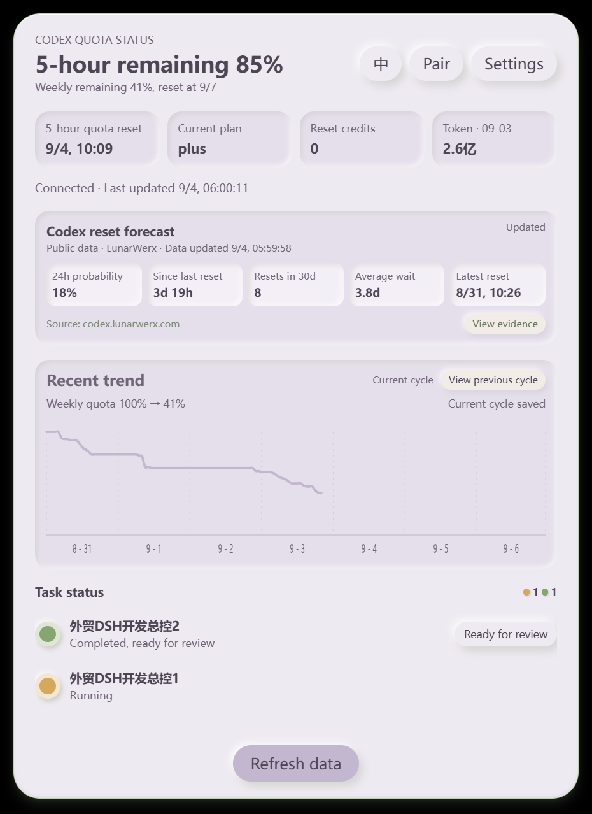
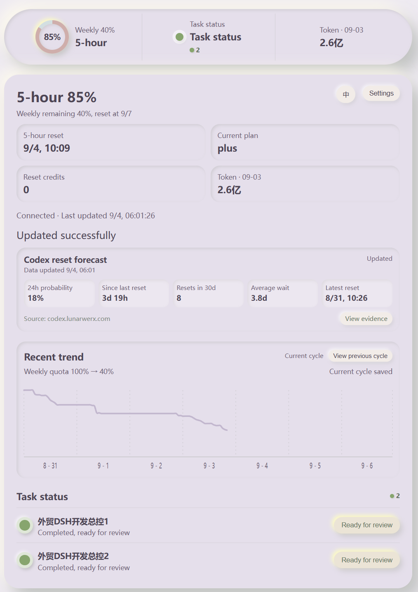
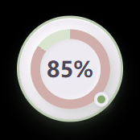
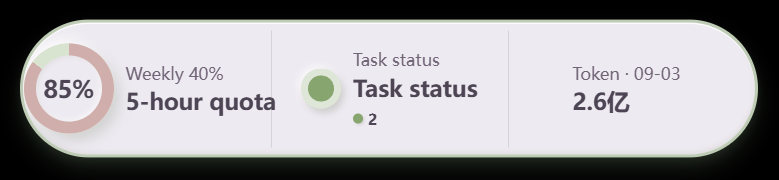
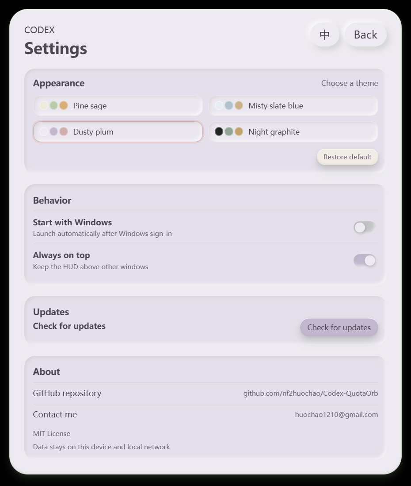

# Codex QuotaOrb

[中文说明 / Chinese README](README.zh-CN.md)

<p align="center"><strong>A quiet, local-first companion for watching Codex quota and task progress.</strong></p>

<p align="center">
  <a href="https://github.com/nf2huochao/Codex-QuotaOrb/releases">Download for Windows</a> ·
  <a href="https://github.com/nf2huochao/Codex-QuotaOrb/releases/tag/v1.0.2">v1.0.2 release</a> ·
  <a href="LICENSE">MIT License</a>
</p>

Codex QuotaOrb keeps the information you need beside Codex without becoming another chat client. A small Windows HUD shows the current quota at a glance; the details view gives you the complete picture; a phone on the same Wi‑Fi can observe the same snapshot through the built-in LAN web view.

## Why QuotaOrb

Codex exposes useful state while you work, but it is easy to lose the quota, reset timing, or task status behind another window. QuotaOrb turns that state into a calm, glanceable companion:

- **Local-first:** reads the Codex state available on the Windows host; prompts, session bodies, passwords, and files are not uploaded.
- **One snapshot, several surfaces:** the floating orb, capsule, desktop details page, and mobile web page share the same task, quota, and Token snapshot.
- **Designed for the phone:** pair once from the desktop, open the LAN address on a phone, and keep the dashboard available while you move away from the Windows screen.

## Screenshots

These are captures of the desktop application and its LAN web view, not marketing mockups.

### Desktop details

<p align="center"></p>

The details page combines weekly quota, five-hour Plus quota, plan, reset credits, dated daily Token usage, reset forecast, the seven-day trend, and task status in one compact surface.

### Mobile LAN view

<p align="center"></p>

The mobile page is a responsive browser view of the same host snapshot. It needs no mobile installation: keep QuotaOrb running on Windows, pair once, then revisit the saved LAN address from the same Wi‑Fi.

### Floating views

<p align="center"> </p>

Double-click the orb to cycle through the orb, capsule, and details views.

### Settings

<p align="center"></p>

The settings page keeps theme, startup, always-on-top, update, repository, and contact controls together.

## What's new in v1.0.2

- Replaced the trend strip with one smooth static curve; the final light point and other point effects are removed.
- Centered the seven date labels in their daily time ranges and switched them to a normal, readable UI font on desktop and mobile.
- Kept the 168-hour hover columns and date/quota details while leaving future hours unpainted.
- Refreshed the README with real English desktop and mobile screenshots.

## Features

### Quota at a glance

- Weekly remaining percentage and reset date.
- Plus users get a separate five-hour quota and reset time; higher plans keep their existing quota presentation.
- The capsule keeps the labels short: weekly remaining and five-hour quota.
- Dated daily Token usage stays visible and is not mixed with quota calculations.

### Reset-cycle trend

The recent trend starts from the detected weekly reset boundary and keeps a complete seven-day timeline (168 hourly positions). It is persisted locally, so closing and reopening the app does not erase the current cycle.

- One smooth curve shows the observed quota path.
- Future hours are left blank until their time arrives; carried-forward values continue the path only through the latest observed hour.
- The first point of a cycle is normalized to 100%; missing early hours inherit that starting value.
- Hover any hourly column to see its date, hour, quota, and whether it was sampled or carried forward.
- A separate **View previous cycle** control shows the saved previous cycle when data exists; otherwise it reports **No data**.

### Codex reset forecast

The details page and mobile web page include a compact forecast sourced from [codex.lunarwerx.com](https://codex.lunarwerx.com/):

- reset probability in the next 24 hours;
- elapsed time since the last reset;
- reset count in the last 30 days;
- average waiting time;
- latest reset time;
- source link and a **View evidence** button.

The panel shows its data-update time and marks stale data clearly. It is a public-data aid, not a guarantee of Codex behavior.

### Tasks and pairing

- Task status is shown as running, needs action, completed/ready for review, or no active tasks.
- Original task text is kept; only status labels and interface explanations are translated.
- Pairing settings provide a four-digit code, LAN address, copy-code action, connection retest, and reset pairing action.
- Desktop and mobile views use the same task snapshot and status counts.

### Themes and behavior

The settings page provides four restrained themes with nested panel colors:

- Pine Sage
- Misty Slate Blue
- Dusty Plum
- Night Graphite

It also includes bilingual switching, start with Windows, always on top, and check for updates. When quota or task data changes, the status point uses a low-frequency breathing hint rather than a distracting animation. Page transitions, buttons, and loading feedback stay short and localized; reduced-motion preferences are respected.

### Updates

The **Update data** action reports updating, success, or temporary failure so a refresh never feels ambiguous. The tray menu also includes **Check for updates**.

Windows releases are built by GitHub Actions and publish a signed installer, `latest.json`, and the matching `.sig` updater artifact. The desktop updater verifies the signature before installing and restarting the app.

## Installation

1. Download the latest Windows x64 installer from [GitHub Releases](https://github.com/nf2huochao/Codex-QuotaOrb/releases).
2. Run the `.exe` installer. Quit an older running instance from the tray first if necessary.
3. Start Codex, then start Codex QuotaOrb.
4. Open **Pair** in the details page, scan or copy the LAN address, and enter the four-digit code on a phone connected to the same Wi‑Fi.

The current stable release is [v1.0.2](https://github.com/nf2huochao/Codex-QuotaOrb/releases/tag/v1.0.2). Older releases remain available and are not overwritten.

## How it works

QuotaOrb keeps one in-memory `SnapshotStore` for the floating surfaces and the details page. The local session watcher and Codex app-server channel supply task, quota, and usage state; lifecycle hooks can add prompt, permission, stop, and session-end signals when the host exposes them. The LAN server serves the same snapshot to paired devices and does not become a cloud relay.

The trend store is local to the host. A reset-derived cycle key starts a new seven-day record; each successful sample is saved with its hour and source. Future slots remain gray until their time arrives, while unsampled past slots carry forward the last known value.

## Privacy and boundaries

- Reads local Codex state by default; does not collect or upload prompts, command content, credentials, session bodies, or file contents.
- The mobile page is LAN-only and requires the Windows host to remain online; there is no built-in public tunnel or cloud account sync.
- Approvals and rejections are always completed in Codex; QuotaOrb never auto-approves.
- The reset forecast is based on public LunarWerx data and may become stale or unavailable.
- Updater private keys belong only in GitHub Actions Secrets and must never be committed.

## Platform support

| Surface | Support |
| --- | --- |
| Windows desktop | Windows 10/11 x64 |
| Mobile browser | Modern iPhone, Android, tablet, and Kindle browsers on the same Wi‑Fi |
| macOS/Linux native HUD | Not included |
| Public remote access | Not included |

## Development

Requirements: Node.js, Rust, and Windows C++ build tools.

```powershell
npm.cmd install
npm.cmd test
npm.cmd run build
npm.cmd run tauri dev
```

Build a Windows installer locally:

```powershell
npm.cmd run tauri build
```

Release signing and updater secrets are documented in [`docs/release-signing.md`](docs/release-signing.md).

## License

Codex QuotaOrb is released under the [MIT License](LICENSE). Third-party dependencies remain under their own licenses.

## Links

- [GitHub repository](https://github.com/nf2huochao/Codex-QuotaOrb)
- [GitHub Releases](https://github.com/nf2huochao/Codex-QuotaOrb/releases)
- [Codex reset forecast source](https://codex.lunarwerx.com/)
- Contact: [huochao1210@gmail.com](mailto:huochao1210@gmail.com)
