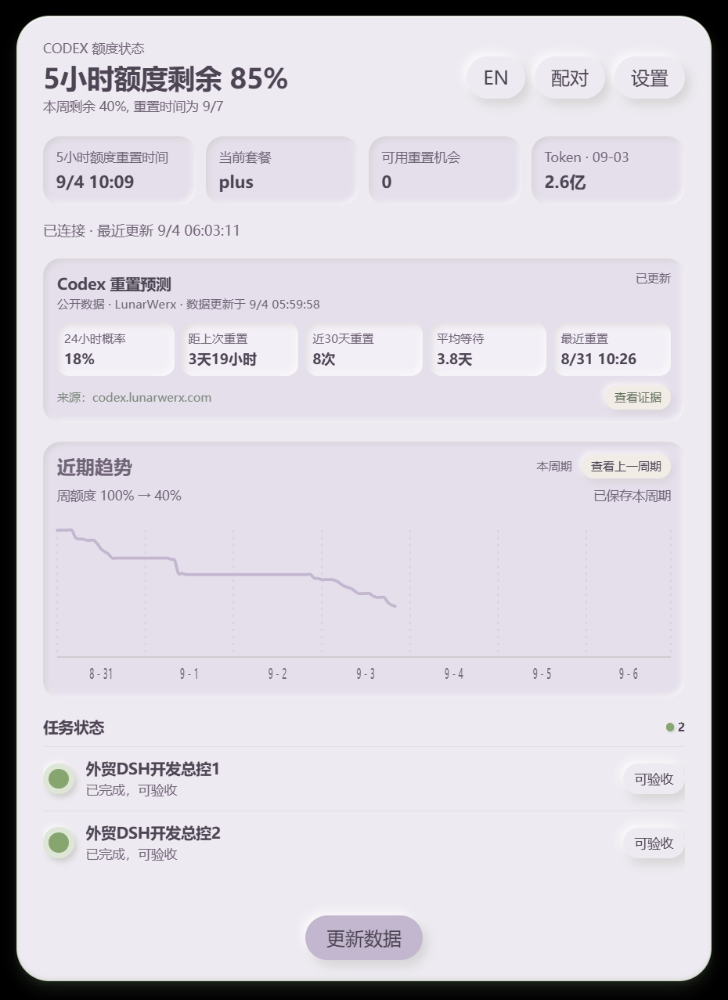
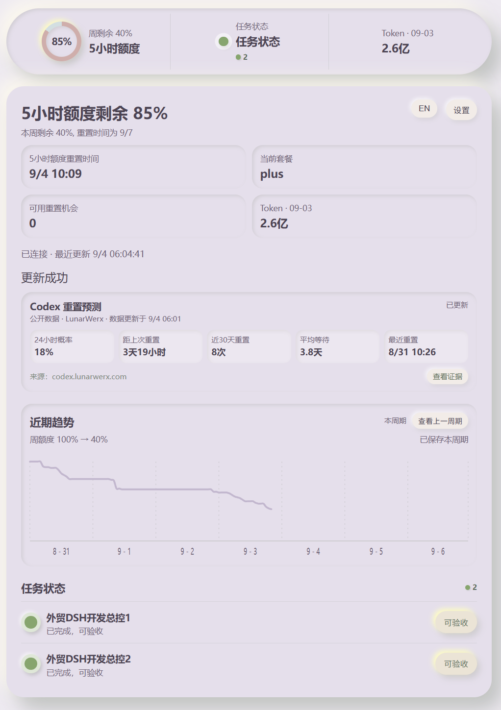
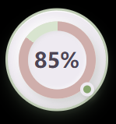
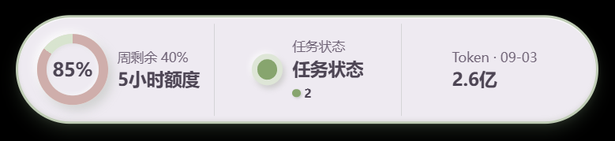
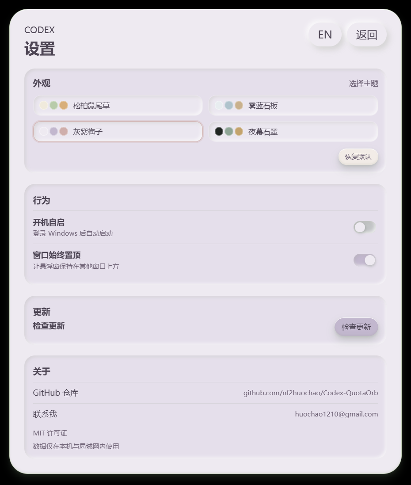

# Codex 额度悬浮窗

[English README](README.md)

<p align="center"><strong>安静、离线优先的 Codex 额度与任务状态伴侣。</strong></p>

<p align="center">
  <a href="https://github.com/nf2huochao/Codex-QuotaOrb/releases">下载 Windows 版</a> ·
  <a href="https://github.com/nf2huochao/Codex-QuotaOrb/releases/tag/v1.0.2">v1.0.2 发行版</a> ·
  <a href="LICENSE">MIT 许可证</a>
</p>

Codex 额度悬浮窗把需要随时关注的信息放在 Codex 旁边，不会变成另一个聊天客户端。Windows 桌面端用小型悬浮窗显示额度，详情页集中展示完整信息，同一 Wi‑Fi 下的手机可以通过内置局域网网页查看同一份快照。

## 为什么做它

Codex 工作时会产生很多有用状态，但额度、重置时间和任务进度很容易被其他窗口遮住。本项目把这些状态整理成安静、易扫读的伴侣：

- **本地优先：**读取 Windows 主机上可获得的 Codex 状态，不上传提示词、会话正文、密码或文件。
- **一份快照，多种界面：**悬浮球、胶囊、桌面详情页和手机网页使用同一份任务、额度和 Token 快照。
- **重点照顾手机：**桌面端配对一次，手机打开局域网地址，即使离开电脑也能继续查看状态。

## 界面截图

以下是桌面应用和局域网网页的实际界面截图，不是宣传样机。

### 桌面详情页

<p align="center"></p>

详情页集中显示周额度、Plus 五小时额度、套餐、重置机会、带日期的本日 Token、重置预测、7 天趋势和任务状态。

### 手机局域网网页

<p align="center"></p>

手机网页是同一份主机快照的响应式浏览器界面，不需要安装手机 App。保持 Windows 端运行，在同一 Wi‑Fi 下配对一次即可反复打开。

### 悬浮视图

<p align="center"> </p>

双击悬浮球可循环切换悬浮球、胶囊和详情页。

### 设置页

<p align="center"></p>

设置页集中提供主题、开机自启、始终置顶、更新、仓库和联系入口。

## v1.0.2 本次更新

- 近期趋势改为一条平滑静态曲线，移除最后光点及其他点状动态效果。
- 7 个日期标签按每天时间段居中，桌面端和手机端统一使用正常、易读的界面字体。
- 保留 168 个小时悬停区域，可查看日期和额度；未来时间未到达前不绘制曲线。
- 自述文件改用真实的中文桌面端和手机端界面截图。

## 功能特性

### 额度一眼可见

- 显示周剩余百分比和重置日期。
- Plus 用户独立显示 5 小时额度和重置时间；更高套餐保持原有额度展示方式。
- 胶囊使用简短标签：周剩余、5 小时额度。
- 本日 Token 保留日期显示，不与额度计算混用。

### 按重置周期记录趋势

近期趋势从识别出的周额度重置边界开始计算，固定保留完整 7 天时间轴（168 个小时位置），并保存到本地，关闭再打开不会清空本周期。

- 一条平滑曲线展示已观测到的额度变化。
- 未来时间在到达前保持空白；沿用额度只延伸到最近一个已观测时间。
- 每个周期的第一个点固定为 100%；起始阶段没有记录的时间沿用 100%。
- 鼠标悬停每个小时区域可查看日期、时间、额度，以及“真实采样/沿用”来源。
- 单独的“查看上一周期”按钮用于查看已保存的上一周期；没有数据时显示“无数据”。

### Codex 重置预测

桌面详情页和手机网页提供紧凑的 [codex.lunarwerx.com](https://codex.lunarwerx.com/) 公开数据专栏：

- 未来 24 小时重置概率；
- 距上次重置的时间；
- 近 30 天重置次数；
- 平均等待时间；
- 最近一次重置时间；
- 来源网址和“查看证据”按钮。

专栏显示数据更新时间，数据过期时会明确标记。这是公开数据辅助，不代表 Codex 的保证时间。

### 任务与配对

- 任务状态显示执行中、需要处理、已完成/可验收或无活跃任务。
- 保留任务原文，只翻译状态标签和界面说明。
- 配对设置提供四位配对码、局域网地址、复制配对码、重新测试连接和重置配对。
- 桌面端和手机端使用同一份任务快照与状态统计。

### 主题与行为

设置页提供四种低饱和、层次协调的主题：

- 松柏鼠尾草
- 雾蓝石板
- 灰紫梅子
- 夜幕石墨

同时支持中英文切换、开机自启、窗口始终置顶和检查更新。额度或任务发生变化时，状态点使用低频呼吸提醒，不持续打扰；页面切换、按钮和加载反馈保持短促，并遵循系统的减少动态效果设置。

### 更新

“更新数据”会明确显示正在更新、更新成功或暂时失败。托盘菜单提供“检查更新”。

Windows 发行流程由 GitHub Actions 构建，并发布签名安装包、`latest.json` 和对应 `.sig` 文件。桌面更新器会先验证签名，再安装并重启应用。

## 安装

1. 从 [GitHub Releases](https://github.com/nf2huochao/Codex-QuotaOrb/releases) 下载最新 Windows x64 安装包。
2. 运行 `.exe` 安装程序；如旧版本正在运行，请先从托盘退出。
3. 启动 Codex，再启动 Codex 额度悬浮窗。
4. 在详情页打开“配对”，复制或扫描局域网地址，在同一 Wi‑Fi 的手机上输入四位配对码。

当前稳定版是 [v1.0.2](https://github.com/nf2huochao/Codex-QuotaOrb/releases/tag/v1.0.2)，旧版本仍保留，不会被覆盖。

## 工作方式

悬浮界面和详情页共用内存中的 `SnapshotStore`。本机会话监听器和 Codex app-server 提供任务、额度和用量状态；当宿主提供生命周期 Hook 时，还可以补充提示、权限、停止和会话结束信号。局域网服务只向已配对设备提供同一份快照，不充当云端中转。

趋势数据保存在本机。由重置时间生成的周期标识会开启新的 7 天记录；每次成功采样都按小时和来源保存。未来位置在到达前保持灰色，过去但没有新采样的位置沿用最后已知额度。

## 隐私与边界

- 默认只读本机 Codex 状态，不收集或上传提示词、命令、凭据、会话正文或文件内容。
- 手机网页仅限局域网访问，需要 Windows 主机保持开机；没有内置公网隧道或云端账户同步。
- 批准和拒绝始终在 Codex 中完成，悬浮窗不会自动批准。
- 重置预测来自 LunarWerx 公开数据，可能过期或暂时不可用。
- 更新签名私钥只应保存在 GitHub Actions Secrets，绝不提交到仓库。

## 平台支持

| 界面 | 支持情况 |
| --- | --- |
| Windows 桌面端 | Windows 10/11 x64 |
| 手机浏览器 | 同一 Wi‑Fi 下的现代 iPhone、Android、平板和 Kindle 浏览器 |
| macOS/Linux 原生悬浮窗 | 暂不支持 |
| 公网远程访问 | 暂不支持 |

## 开发

需要 Node.js、Rust 和 Windows C++ 构建工具。

```powershell
npm.cmd install
npm.cmd test
npm.cmd run build
npm.cmd run tauri dev
```

本地构建 Windows 安装包：

```powershell
npm.cmd run tauri build
```

签名和更新配置见 [`docs/release-signing.md`](docs/release-signing.md)。

## 许可证

本项目采用 [MIT License](LICENSE)。第三方依赖仍受其各自许可证约束。

## 链接

- [GitHub 仓库](https://github.com/nf2huochao/Codex-QuotaOrb)
- [GitHub Releases](https://github.com/nf2huochao/Codex-QuotaOrb/releases)
- [Codex 重置预测来源](https://codex.lunarwerx.com/)
- 联系邮箱：[huochao1210@gmail.com](mailto:huochao1210@gmail.com)
